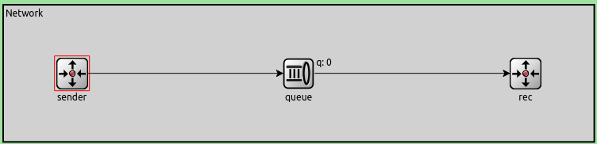

# Análisis y Diseño de Mecanismos de Control de Flujo y Congestión en Redes Simplificadas utilizando OMNET++

Informe técnico de la tarea de análisis correspondiente al laboratorio 3 de Redes y Sistemas Distribuidos - Primer cuatrimestre, FAMAF 2025.

# Índice

- [Análisis y Diseño de Mecanismos de Control de Flujo y Congestión en Redes Simplificadas utilizando OMNET++](#análisis-y-diseño-de-mecanismos-de-control-de-flujo-y-congestión-en-redes-simplificadas-utilizando-omnet)
- [Índice](#índice)
- [Abstract](#abstract)
- [Introducción](#introducción)
  - [Control de flujo y control de congestión](#control-de-flujo-y-control-de-congestión)
- [Análisis de la red sin control de congestión ni flujo](#análisis-de-la-red-sin-control-de-congestión-ni-flujo)
  - [Introducción a la red básica](#introducción-a-la-red-básica)
  - [Caso I: Problemas de flujo](#caso-i-problemas-de-flujo)
    - [Hipótesis](#hipótesis)
    - [Mediciones realizadas](#mediciones-realizadas)
    - [Análisis de los resultados Caso I](#análisis-de-los-resultados-caso-i)
      - [Evaluación del comportamiento de la red bajo carga variable](#evaluación-del-comportamiento-de-la-red-bajo-carga-variable)
      - [Fase inicial: Sin congestión ni retrasos significativos](#fase-inicial-sin-congestión-ni-retrasos-significativos)
      - [Fase transitoria: Acumulación de colas sin pérdida de paquetes](#fase-transitoria-acumulación-de-colas-sin-pérdida-de-paquetes)
  - [Caso II: Problemas de congestión](#caso-ii-problemas-de-congestión)
    - [Hipótesis](#hipótesis-1)
    - [Mediciones realizadas Caso II](#mediciones-realizadas-caso-ii)
      - [Análisis de los resultados Caso II](#análisis-de-los-resultados-caso-ii)
        - [Comportamiento de la cola intermedia y cuello de botella](#comportamiento-de-la-cola-intermedia-y-cuello-de-botella)
        - [Estado de la cola del receptor](#estado-de-la-cola-del-receptor)
        - [Métricas representativas por carga ofrecida](#métricas-representativas-por-carga-ofrecida)
  - [Conclusión inicial](#conclusión-inicial)
    - [¿Qué diferencia observa entre el caso de estudio I y II? ¿Cuál es la fuente limitante en cada uno?](#qué-diferencia-observa-entre-el-caso-de-estudio-i-y-ii-cuál-es-la-fuente-limitante-en-cada-uno)
    - [General](#general)
- [Algoritmo propio - Explicación y análisis](#algoritmo-propio---explicación-y-análisis)
  - [Diseño de la implementación TLCP](#diseño-de-la-implementación-tlcp)
  - [Caso I con TLCP](#caso-i-con-tlcp)
    - [Hipótesis del comportamiento esperado: Caso I](#hipótesis-del-comportamiento-esperado-caso-i)
    - [Mediciones TLCP Caso II](#mediciones-tlcp-caso-ii)
    - [Análisis de los resultados TLCP Caso I](#análisis-de-los-resultados-tlcp-caso-i)
      - [Desempeño del protocolo bajo condiciones extremas](#desempeño-del-protocolo-bajo-condiciones-extremas)
      - [Ausencia de pérdida de paquetes y estabilidad de RTT](#ausencia-de-pérdida-de-paquetes-y-estabilidad-de-rtt)
      - [Aumento del retraso promedio](#aumento-del-retraso-promedio)
  - [Caso II con TLCP](#caso-ii-con-tlcp)
    - [Hipótesis del comportamiento esperado: Caso II](#hipótesis-del-comportamiento-esperado-caso-ii)
    - [Mediciones TLCP Caso II](#mediciones-tlcp-caso-ii-1)
    - [Análisis de los resultados TLCP Caso I](#análisis-de-los-resultados-tlcp-caso-i-1)
      - [Aumento del retraso promedio](#aumento-del-retraso-promedio-1)
      - [Desempeño bajo baja carga](#desempeño-bajo-baja-carga)
      - [Comportamiento bajo alta carga](#comportamiento-bajo-alta-carga)
      - [Observaciones clave](#observaciones-clave)
- [Discusión](#discusión)
  - [Análisis comparativo entre la red sin control y la red con TLCP: ¿Cómo se comporta TLCP en comparación con la red original?](#análisis-comparativo-entre-la-red-sin-control-y-la-red-con-tlcp-cómo-se-comporta-tlcp-en-comparación-con-la-red-original)
  - [¿Funciona de manera equivalente en el Caso I y el Caso II?](#funciona-de-manera-equivalente-en-el-caso-i-y-el-caso-ii)
    - [Desempeño en el Caso I](#desempeño-en-el-caso-i)
    - [Desempeño en el Caso II](#desempeño-en-el-caso-ii)
  - [¿Cómo creen que se comporta su algoritmo de control de flujo y congestión?](#cómo-creen-que-se-comporta-su-algoritmo-de-control-de-flujo-y-congestión)
    - [Desempeño por escenario: Control de flujo (Caso I)](#desempeño-por-escenario-control-de-flujo-caso-i)
  - [Desempeño por escenario: Control de congestión (Caso II)](#desempeño-por-escenario-control-de-congestión-caso-ii)
    - [Observaciones adicionales](#observaciones-adicionales)
  - [Buenas prácticas](#buenas-prácticas)
  - [Mejoras](#mejoras)
- [Referencias](#referencias)


# Abstract

En este laboratorio se estudia el comportamiento de las redes frente a problemas de congestión y flujo con la herramienta de simulación por eventos discretos OMNET++. Utilizando una simulación discreta sobre una red simplificada se realizó un análisis con el objetivo de identificar de qué escenario se trataba, dónde se produce el cuello de botella y en qué módulo ocurre. Un escenario presenta problemas por congestión y otro por problemas de flujo.

Posteriormente se realizó un diseño e implementación de control de ambos problemas y se estudió la efectividad en dichos escenarios.

# Introducción

El objetivo principal de este trabajo es analizar los efectos de problemas de flujo y congestión en una red simplificada, identificar sus causas fundamentales y proponer soluciones basadas en mecanismos de control adaptativo.

En este estudio, utilizamos OMNET++, una plataforma de simulación de redes ampliamente reconocida por su flexibilidad y precisión, para modelar y analizar una red simplificada. A través de esta simulación, evaluaremos cómo diferentes tasas de generación de paquetes impactan el rendimiento global de la red, identificando las limitaciones inherentes y explorando posibles soluciones. Este análisis no solo contribuye a una mejor comprensión de los problemas de flujo y congestión, sino que también sienta las bases para el diseño de mecanismos de control más robustos y eficientes.

## Control de flujo y control de congestión

El control de flujo  y el control de congestión son dos mecanismos esenciales para garantizar un rendimiento eficiente en las redes de comunicaciones. Aunque ambos tienen como objetivo mejorar la calidad del servicio, se enfocan en aspectos diferentes del problema:

- **Control de flujo** se centra en manejar el problema de un *emisor veloz* y un *receptor lento*. Su objetivo principal es evitar que el emisor sature al receptor enviando datos más rápido de lo que este puede procesarlos.
- **Control de congestión** aborda los *problemas de red entre el emisor y el receptor*. Su objetivo es evitar que la red se sobrecargue, lo que podría llevar a la pérdida de paquetes y a un deterioro general del rendimiento.

Aunque el control de flujo y el control de congestión tienen objetivos distintos, ambos mecanismos deben trabajar en conjunto para garantizar un rendimiento óptimo. Por ejemplo, un control de flujo inadecuado podría exacerbar los problemas de congestión, mientras que una red congestionada podría limitar la efectividad del control de flujo.

# Análisis de la red sin control de congestión ni flujo

## Introducción a la red básica

La red simplificada consta de tres componentes principales: un emisor (`sender`), un receptor  (`receiver`) y un nodo intermedio (`queue`) que simboliza la subred entre el transmisor y el receptor. Esta configuración permite estudiar los efectos de problemas de flujo y congestión en un entorno controlado.



- El **emisor** genera paquetes de *12500 bytes* bajo una distribucción exponencial centrada en un tiempo **`T`** (s) y tanto la `queue` intermedia como el receptor tienen un buffer interno para manejar paquetes entrantes. Estos buffers tienen capacidades limitadas, lo que puede llevar a problemas como buffer overflow si la tasa de llegada de paquetes supera la capacidad de procesamiento.

- El **receptor** tiene un *datarate* interno para su `Sink`. El Sink modela lo que sería la capa de aplicación del lado del receptor, y este datarate  existe para simular problemas de flujo propios del receptor, como la incapacidad de procesar datos a la misma velocidad a la que los recibe.

Esta configuración es ideal para analizar cómo diferentes tasas de generación de paquetes y capacidades de procesamiento afectan el rendimiento global de la red. Además, permite identificar claramente dónde ocurren los cuellos de botella y qué tipo de problemas (flujo o congestión) predominan en cada escenario.

## Caso I: Problemas de flujo

| Conexión                           | Datarate      |
|------------------------------------|---------------|
| entre `TransportReceiver` y `RecAppLayer`    | **`0.5Mbps`** |
| entre `emisor` y `nodo intermedio` | **`1.0Mbps`** |

---
> `TransportReceiver` : Capa de transporte del Receptor
>
> `RecAppLayer`: Capa de aplicación del receptor
---

### Hipótesis

Con esos datos podemos ver a simple vista que existe un **cuello de botella** entre las dos capas de aplicación que se encuentra en el receptor mismo.

El *receptor* recibe mensajes más rápidos de lo que puede procesarlos, lo que eventualmente lleva a generar un desbordamiento del buffer interno y por ende el **droppeo** de paquetes.

Este fenómeno es un ejemplo clásico de problemas de *flujo*, donde un emisor veloz sobrecarga a un receptor lento.

Este tipo de situaciones es común en protocolos sin control de flujo explícito. Un ejemplo clásico es UDP, donde el emisor no tiene retroalimentación sobre el estado del receptor, lo que puede llevar fácilmente a sobrecargas locales. En contraste, TCP implementa mecanismos de ventana deslizante para prevenir este tipo de problemas [RFC 793].

### Mediciones realizadas

Para evaluar el comportamiento de la red bajo distintas cargas, se realizaron mediciones variando el intervalo promedio de generación de paquetes (Itv), desde valores altos (baja carga) hasta valores bajos (alta carga). Esto permitió identificar los límites de la red en términos de pérdida de paquetes, retardo promedio y saturación de buffers.

Se construyó una tabla resumen que muestra cómo varían las principales métricas según el valor de Itv. Como punto de partida, se tomó un intervalo grande (T = 2 segundos) para observar el comportamiento de la red bajo condiciones de baja carga.

Bajo estas condiciones, y tal como se esperaba teóricamente, no se registraron pérdidas de paquetes ni retrasos significativos , ya que la velocidad de generación de tráfico estaba muy por debajo de la capacidad de procesamiento del receptor.

**Caso I sin control de congestion ni flujo: tabla de mediciones**

| Itv      | Paquetes Generados | Paquetes entregados | Paquetes perdidos Q | Paquetes perdidos R   | Retraso de entrega promedio [s] |
|----------|----------|----------|--------|----------|-----------|
| **2.0**  | **144**  | **144**  | **0**  | **0**    | **0.40**  |
| 0.8      | 367      | 367      | 0      | 0        | 0.43      |
| 0.4      | 754      | 754      | 0      | 0        | 0.49      |
| 0.25     | 1190     | 1187     | 0      | 0        | 0.72      |
| 0.2      | 1494     | 1469     | 0      | 0        | 2.41      |
| **0.18** | **1664** | **1494** | **0**  | **0**    | **14.52** |
| 0.15     | 1979     | 1498     | 0      | 278      | 29.16     |
| **0.1**  | **2933** | **1498** | **0**  | **1231** | **35.83** |

### Análisis de los resultados Caso I

#### Evaluación del comportamiento de la red bajo carga variable

Durante las simulaciones realizadas, se observó cómo varía el desempeño de la red a medida que se incrementa la carga ofrecida, variando el intervalo promedio (Itv) de generación de paquetes. Los resultados obtenidos muestran claramente cómo el cuello de botella interno en el receptor afecta tanto la latencia como la capacidad de procesamiento.

#### Fase inicial: Sin congestión ni retrasos significativos

Para valores de Itv mayores o iguales a 0.25 segundos, la red opera sin prácticamente ningún retraso perceptible. Esto indica que:

- El tráfico generado no supera la capacidad de procesamiento del receptor.
- Las colas (tanto en el emisor como en la subred) permanecen vacías o casi vacías durante toda la ejecución.
- El retraso promedio se mantiene estable en torno a 0.4 segundos.

#### Fase transitoria: Acumulación de colas sin pérdida de paquetes

Al disminuir el valor de Itv por debajo de 0.25 segundos , comienza a notarse un aumento progresivo en el uso de los buffers. En particular, al llegar a un intervalo de 0.18 segundos , se observa lo siguiente:

- Aumenta considerablemente el retraso promedio, pasando de 0.4 s  a 14.52 s , es decir, un crecimiento de dos órdenes de magnitud.
- No hay pérdida de paquetes en este punto, lo cual refleja que el sistema aún está dentro de sus límites operativos.
- La cola del emisor comienza a llenarse debido a la acumulación temporal de paquetes antes de ser procesados por el receptor.

**Generación de paquetes con distribución exponencial de media = 0.18s**


- Total de paquetes generados y almacenados en el buffer del emisor: `1664` (`166.4. Mb`)
- Total de paquetes recibidos y almacenados en el buffer de la subred: `1494` (`149.4 Mb`)
- Total de paquetes recibidos y almacenados en el buffer del receptor: `1494` (`149.4 Mb`)

## Caso II: Problemas de congestión

| Conexión                           | Datarate      |
|------------------------------------|---------------|
| entre `TransportReceiver` y `RecAppLayer`    | **`1.0Mbps`** |
| entre `emisor` y `nodo intermedio` | **`0.5Mbps`** |

---
> `TransportReceiver` : Capa de transporte del Receptor
>
> `RecAppLayer`: Capa de aplicación del receptor
---

### Hipótesis

En este caso se percibe que la velocidad de generación es más rápida que la velocidad de las cola en recibir y enviar el paquete al `Sink`. Igual que el caso I exceptuando que el cuello de botella se encuentra en la subred (`queue`).

A medida que el emisor genera paquetes a una tasa alta, la cola intermedia comienza a llenarse progresivamente. Cuando la cola alcanza su capacidad máxima, los paquetes adicionales se descartan (dropeos), lo que provoca una pérdida significativa de datos.

Este es un claro **problema de congestión**, la interred no puede manejar la velocidad del generador debido a su capacidad limitada y al no haber caminos alternativos siempre habrá problemas de congestión.

### Mediciones realizadas Caso II

**Caso II sin control de congestion ni flujo: tabla de mediciones**

| Itv      | Paquetes Generados | Paquetes entregados | Paquetes perdidos Q | Paquetes perdidos R   | Retraso de entrega promedio [s] |
|----------|----------|----------|----------|--------|-----------|
| **2.0**  | **144**  | **144**  | **0**    | **0**  | **0.40**  |
| 0.8      | 367      | 367      | 0        | 0      | 0.43      |
| 0.4      | 754      | 754      | 0        | 0      | 0.49      |
| 0.25     | 1190     | 1187     | 0        | 0      | 0.72      |
| 0.2      | 1494     | 1469     | 0        | 0      | 2.41      |
| **0.18** | **1664** | **1494** | **67**   | **0**  | **13.25** |
| 0.15     | 1979     | 1498     | 379      | 0      | 17.40     |
| **0.1**  | **2933** | **1498** | **1332** | **0**  | **19.98** |

#### Análisis de los resultados Caso II

##### Comportamiento de la cola intermedia y cuello de botella

En este escenario, el cuello de botella se encuentra en la conexión entre la cola intermedia (`dataQueue`) y el receptor, ya que el ancho de banda de este enlace es la mitad del resto de la red (`0.5 Mbps` frente a `1.0 Mbps`). Esto provoca un desbalance que lleva al llenado progresivo de la cola intermedia.

- El generador envía paquetes a una tasa compatible con el datarate hacia la cola (`1.0 Mbps`), pero esta no puede entregarlos al receptor al mismo ritmo, lo cual genera acumulación de paquetes.
- Una vez saturada la cola intermedia, comienzan las pérdidas de paquetes (*dropping*).

Aunque la progresión del cuello de botella es similar a la observada en el Caso I (la red comienza a congestionarse y perder paquetes en momentos relativamente equivalentes), hay una diferencia clave: El tamaño del buffer intermedio es menor que el del buffer del receptor del Caso I , por lo que las pérdidas de paquetes ocurren antes y son más significativas. Fuera de este detalle, el comportamiento general del cuello de botella es muy similar al Caso I, si bien ubicado en una capa diferente de la red.

##### Estado de la cola del receptor

A diferencia del Caso I, en esta configuración no se observan pérdidas de paquetes en la cola del receptor . Esto se debe a que el ancho de banda entre la cola intermedia y el receptor (`RecAppLayer`) es mayor que el necesario para manejar el tráfico que llega desde dicha cola.

- Como resultado, el buffer del receptor rara vez se llena por completo.
- Esto también influye en una reducción del retardo promedio  comparado con el Caso I, ya que los paquetes fluyen sin acumularse en esta última etapa.

##### Métricas representativas por carga ofrecida

**Generación de paquetes con distribución exponencial de media = 0.1s**


- Paquetes generados y almacenados en el buffer del emisor: `2933` (`293.3 Mb`)
- Paquetes recibidos y almacenados en el buffer de la subred: `1498` (`149.8 Mb`)
- Paquetes recibidos y almacenados en el buffer del receptor: `1498` (`149.8 Mb`)

Este caso representa una situación de alta carga, donde se aprecia claramente cómo la cola intermedia se satura, provocando descartes de paquetes.

**Generación de paquetes con distribución exponencial de media = 0.18s**


- Paquetes generados y almacenados en el buffer del emisor: `1664` (`166.4 Mb`)
- Paquetes recibidos y almacenados en el buffer de la subred: `1494` (`149.4 Mb`)
- Paquetes recibidos y almacenados en el buffer del receptor: `1494` (`149.4 Mb`)

En este punto, aunque la red aún no está completamente saturada, se empieza a notar el efecto del cuello de botella. La cola intermedia comienza a acumular paquetes, pero no llega a colapsar totalmente.

Este escenario representa claramente un problema de congestión , donde el cuello de botella se encuentra en la subred intermedia. A diferencia del Caso I (flujo), aquí la pérdida de paquetes es consecuencia directa de la saturación de la cola intermedia, y no del receptor.

NOTA: Para mitigar estos efectos, sería ideal implementar mecanismos de control de congestión como ECN (Explicit Congestion Notification) o RED (Random Early Detection), que permiten detectar condiciones de sobrecarga antes de que ocurra la pérdida de paquetes [RFC 3168].

## Conclusión inicial

### ¿Qué diferencia observa entre el caso de estudio I y II? ¿Cuál es la fuente limitante en cada uno?

Al analizar ambos casos, se identifican las siguientes diferencias clave:

- Aunque en ambos escenarios persiste un cuello de botella, su ubicación varía entre uno y otro. No obstante, la capacidad máxima de tráfico útil sigue siendo la misma (1498 paquetes), lo cual respalda el supuesto inicial.

- El primer caso está asociado a una limitación en el flujo de datos, mientras que el segundo refleja una situación típica de congestión en la red.

- La menor capacidad del buffer en la subred del caso II, en comparación con el receptor, provoca que el colapso del rendimiento ocurra un poco antes respecto al primer caso.

- En ambos ejemplos, el factor que restringe el desempeño es la disparidad en los anchos de banda entre las conexiones involucradas.

### General

El principal desafío que enfrenta la red en ambos casos es la presencia de un cuello de botella:

- En el primer escenario, el punto crítico se encuentra en la conexión interna dentro de la capa receptora, específicamente entre el nodo *sink* y su cola asociada.
- En el segundo caso, el cuello de botella está ubicado en el enlace que conecta la capa receptora con la cola intermedia.

En ambos casos, cuando las colas llegan a su capacidad máxima, comienzan a descartar paquetes. Este comportamiento es característico de sistemas saturados y afecta directamente la eficiencia del flujo de datos.

**Posibles soluciones para mitigar la pérdida de paquetes:**

- Incrementar el ancho de banda en los canales identificados como puntos críticos.
- Implementar mecanismos de retransmisión para recuperar los paquetes descartados.
- Diseñar e integrar estrategias de control de congestión que permitan prever y gestionar situaciones de sobrecarga.

Con el objetivo de facilitar el análisis posterior y mejorar la calidad estadística de los resultados obtenidos, se realizaron las siguientes modificaciones a la simulación original:

1. **Tamaño del buffer:**
   Se redujo de **200** a **100** paquetes en el nodo intermedio `queue`.
   > Esto permitió observar de manera más precisa el comportamiento de la red bajo condiciones de congestión.

2. **Duración de la simulación:**
   Se extendió de **200 segundos** a **300 segundos**.
   > Este ajuste ayudó a obtener promedios más estables, considerando la naturaleza aleatoria en la generación de paquetes.

# Algoritmo propio - Explicación y análisis

## Diseño de la implementación TLCP

<!-- Explicación de la implementación propia -->
<!-- Sección que describe la contribución realizada: algoritmos propuestos para la tarea de diseño -->

Nuestra implementación de este laboratorio se basó en el algoritmo de TLCP, Transport Limited Control Protocol, algoritmo que implementa tanto *control de flujo* como *control de congestión*.

Inicialmente, buscamos registrar los paquetes de la red, lo que llevó a la implementación de `RenoManager.h`.

La incorporación de estos módulos y la lógica en el emisor permitió retransmitir paquetes perdidos, y luego el arranque lento permitió después el control de congestión.

Este módulo organiza los paquetes activos en la red y es utilizado por el **Transmisor**.

Un detalle de la implementación es que, al agregar un paquete a la ventana, se inicia un temporizador para su timeout, funcionando como un ttl para decidir cuándo retransmitirlo. También permite recibir feedback del receptor mediante ACKs.

El `RenoManager.h` maneja el tamaño de la ventana, y define si actualmente el sistema está en arranque lento o no.

Al paquete que el emisor y receptor de la capa de transporte se intercambian tiene un poco de información adicional, la cual se puede ver en su implementación llamada `Volt`. Este paquete se generó usando la herramienta de plantillas de omnet con el siguiente esquema:

```cpp
packet Volt {
  bool flags = false;
  int seqNumber;
  int windowSize;
};
```

`seqNumber` indica el orden de los paquetes. *No* implementamos números de secuencia por posición de byte como en el TCP real, sino que simplemente indican una enumeración de los paquetes.

El tamaño de ventana es información que se pasan el emisor y receptor en la capa de transporte, como en la teoría, para informarse si el emisor debe esperar un poco para enviar más paquetes, y así evitar la pérdida de los mismos, como sabemos esto es un ejemplo de control de flujo. El mismo se gestiona almacenando la ventana actual en un entero dentro del **emisor**, denominado `currentControlWindowSize`. Al verificar si se puede enviar un mensaje, se compara este valor con el número de mensajes en el aire. Si la suma de estos y el paquete a enviar no supera la ventana, el envío se permite.

Y por último hay dos flags que modelamos con un número: ACK y RET. Ambas están codificadas en el byte de flags y se gestionan mediante operaciones bitwise y máscaras de bits.

- ACK: Señala que el Volt actual es un ACK y **no** un paquete de datos.
- RET: Indica que el Volt ha sido retransmitido. Si es un ACK, significa que confirma un paquete retransmitido, lo que nos permite ajustar el RTT dinámico.

Para el manejo de **control de congestión**, se implementó Reno con ventana corrediza y gestión de timeouts mediante RTT dinámico.

La clase `SlidingWindow` se basa en un diccionario que guarda metadata del archivo que se podría necesitar retransmitir. La metadata incluye el paquete Volt mismo, el conteo de ACKs (ackCounter), el tiempo de envío (sendTime) y una bandera de retransmisión (retransmitted).

Este mecanismo permite conservar paquetes para una posible retransmisión cuando sea necesario.

Por último el `RenoManager` almacena los distintos timeouts que están en el aire para ver si hay que retransmitir algún paquete. Como dijimos antes, implementamos **arranque lento** como algoritmo para control de congestión. El funcionamiento y efectividad del mismo se puede observar en el segundo caso de estudio del laboratorio.

El cálculo de RTT y RTO se realizó usando el algoritmo de **Jacobson**.

## Caso I con TLCP

### Hipótesis del comportamiento esperado: Caso I

En este escenario, el cuello de botella se encuentra a nivel del host receptor, específicamente entre la capa de transporte (`TransportReceiver`) y la capa de aplicación (`RecAppLayer`). Dado que TLCP tiene acceso directo al estado del buffer del receptor, puede recibir retroalimentación constante sobre su capacidad disponible.

Esto permite que el emisor ajuste dinámicamente su tasa de envío según las señales de disponibilidad de buffer que envía el receptor mediante paquetes ACK. Aunque el cuello de botella sigue existiendo, se espera que TLCP logre un uso eficiente del canal sin provocar pérdida de paquetes.

Suposiciones clave:

- El protocolo mantendrá el buffer del receptor cerca de su capacidad máxima sin llegar a colapsar.
- No se producirán pérdidas de paquetes gracias al mecanismo de control de flujo basado en ventana deslizante.
- El RTT se mantendrá estable, ya que no habrá congestión en la subred intermedia.
- La carga útil será prácticamente óptima, adaptándose a la capacidad real del receptor.


### Mediciones TLCP Caso II

Métricas adicionales disponibles gracias a TLCP

Al haber implementado un protocolo de control de flujo y congestión en la capa de transporte (TLCP), se dispone de nuevas métricas que permiten analizar con mayor detalle el comportamiento de la red. Estas son:

- Ret (Retransmitidos): Número total de paquetes que fueron retransmitidos durante la ejecución de la simulación. Esta métrica es clave para evaluar la estabilidad del sistema y la efectividad de los mecanismos de retroceso (backoff) y detección de pérdidas.

- RTT (Round-Trip Time): Tiempo promedio que transcurre entre el envío de un paquete y la recepción de su ACK correspondiente. En redes sin congestión, este valor tiende a ser estable y bajo, lo cual facilita la estimación de timeouts y mejora la eficiencia del control de flujo.

- ACKt (ACK time): Tiempo promedio desde que se genera un paquete hasta que se recibe su ACK asociado. Esta métrica refleja el tiempo total de procesamiento en el receptor, incluyendo posibles colas internas y retrasos en la generación del mensaje de confirmación.

| Itv      | Gen      | Del      | Drop Q | Drop R | AvDel [s]  | RTT [s]     | ACKt (+-stdev) [s] | Ret   |
|----------|----------|----------|--------|--------|------------|-------------|--------------------|-------|
| **2.0**  | **144**  | **144**  | **0**  | **0**  | **0.40**   | **0.2 (0)** | **0.2** (0)        | **0** |
| 0.8      | 367      | 367      | 0      | 0      | 0.43       | 0.2 (0)     | 0.2  (0)           | 0     |
| 0.4      | 754      | 754      | 0      | 0      | 0.49       | 0.2 (0)     | 0.21 (0)           | 0     |
| 0.25     | 1190     | 1187     | 0      | 0      | 0.72       | 0.2 (0)     | 0.23 (0)           | 0     |
| 0.2      | 1494     | 1469     | 0      | 0      | 2.41       | 0.2 (0)     | 0.25 (0.05)        | 0     |
| **0.18** | **1664** | **1494** | **0**  | **0**  | **14.52**  | **0.2 (0)** | **0.26 (0.1)**     | **0** |
| 0.15     | 1979     | 1498     | 0      | 0      | 36.64      | 0.2 (0)     | 11.4 (3.9)         | 0     |
| **0.1**  | **2933** | **1498** | **0**  | **0**  | **74.41**  | **0.2 (0)** | **49 (19)**        | **0** |
| **0.05** | **5847** | **1498** | **0**  | **0**  | **112.27** | **0.2 (0)** | **92 (66)**        | **0** |

Estas mediciones ofrecen una visión integral del desempeño del protocolo bajo diferentes condiciones de carga, especialmente útiles para comparar los escenarios con y sin control activo.

### Análisis de los resultados TLCP Caso I

#### Desempeño del protocolo bajo condiciones extremas

Como se esperaba, el protocolo TLCP (Transport Limited Control Protocol)  logra un comportamiento prácticamente óptimo incluso bajo cargas elevadas de tráfico. En este escenario, donde el cuello de botella se encuentra dentro del receptor, la implementación demuestra su capacidad para adaptarse dinámicamente al estado del buffer sin provocar pérdida de paquetes.

Durante la simulación:

- La cola del receptor se llenó hasta casi su límite sin llegar a colapsar.
- El emisor ajustó su tasa de envío según las señales de retroalimentación del receptor, garantizando que solo se transmitieran paquetes cuando hubiera espacio disponible en el buffer.
- Esto permite mantener un flujo continuo de datos sin interrupciones ni caídas.

Gracias al mecanismo de ventana deslizante basado en el estado del buffer del receptor, TLCP logra maximizar el uso efectivo del ancho de banda, manteniendo siempre el sistema en equilibrio.

#### Ausencia de pérdida de paquetes y estabilidad de RTT

Uno de los aspectos más destacados del comportamiento de TLCP es la completa ausencia de pérdidas de paquetes, independientemente del nivel de carga ofrecida:

- El RTT promedio se mantuvo constante en 0.2 segundos  durante toda la ejecución, lo cual indica que la red no presentó congestión y que los tiempos de ida y vuelta fueron predecibles.
- Esta estabilidad es consecuencia directa de que el control de flujo evita la saturación de buffers, impidiendo la congestión de la subred intermedia.

NOTA: *Este tipo de comportamiento es consistente con protocolos como TCP cuando opera en modo flow-controlled  [RFC 793].*

#### Aumento del retraso promedio

Aunque no hay pérdida de paquetes, sí se observa un aumento del retardo promedio respecto a la red sin control. Este incremento se debe principalmente al tiempo adicional que tarda el receptor en procesar cada paquete antes de enviar el ACK correspondiente.

Este fenómeno será analizado más detalladamente en la comparación integral entre la red con y sin control , donde podrá verse cómo afecta esta característica en términos de rendimiento general.

**Resultados por escenario de generación de tráfico**

**Generación de paquetes con distribución exponencial de media = 0.05s**


- Total de paquetes generados y almacenados en el buffer del emisor: `5847` (`149.8 Mb`)
- Total de paquetes recibidos y almacenados en el buffer de la subred: `1498` (`149.8 Mb`)
- Total de paquetes recibidos y almacenados en el buffer del receptor: `1498` (`149.8 Mb`)

Este caso representa una situación de alta carga, donde la red está sometida a una generación muy frecuente de paquetes. A pesar de ello, TLCP logra gestionar adecuadamente el tráfico sin descartar ningún paquete.

**Generación de paquetes con distribución exponencial de media = 2.0s**


- Total de paquetes generados y almacenados en el buffer del emisor: `144` (`14.4 Mb`)
- Total de paquetes recibidos y almacenados en el buffer de la subred: `144` (`14.4 Mb`)
- Total de paquetes recibidos y almacenados en el buffer del receptor: `144` (`14.4 Mb`)

En este escenario, la red opera prácticamente sin acumulaciones significativas en ninguna cola, lo cual refleja un flujo totalmente estable y sostenible.

El análisis confirma que TLCP logra un control de flujo eficiente en el Caso I , donde el cuello de botella está localizado en el receptor. Al tener acceso directo al estado del buffer, el protocolo puede adaptar dinámicamente la tasa de envío del emisor, asegurando un uso máximo del canal sin comprometer la integridad de los datos.

## Caso II con TLCP

| Conexión                                 | Datarate      |
|------------------------------------------|---------------|
| entre `TransReceiver` y `RecAppLayer`    | **`1.0Mbps`** |
| entre `emisor` y `nodo intermedio`       | **`0.5Mbps`** |

### Hipótesis del comportamiento esperado: Caso II

En este escenario, el cuello de botella se encuentra en la cola intermedia (dataQueue), lo cual significa que TLCP no tiene acceso directo al estado del buffer congestionado , sino que debe estimar las condiciones de la red a través de señales indirectas como los tiempos de ida y vuelta (RTT) y la aparición de timeouts.

Dado este contexto, se espera lo siguiente del comportamiento del protocolo:

- Menor eficiencia en el uso del ancho de banda: A diferencia del Caso I, donde el control de flujo permite aprovechar al máximo la capacidad efectiva del receptor, en este caso la estimación reactiva del estado de congestión limita la carga útil. Por tanto, el desempeño será bueno, pero no óptimo.

- Ausencia de pérdida de paquetes: A pesar de no tener visibilidad directa sobre la subred, el mecanismo de control de congestión implementado debería evitar la caída de paquetes, gracias a ajustes proactivos basados en timeouts y fluctuaciones del RTT.

- Posibles retransmisiones innecesarias: Debido a la naturaleza reactiva del control de congestión, es probable que ocurran retransmisiones causadas por timeouts  prematuros, especialmente bajo cargas altas o en presencia de variaciones abruptas del RTT.

- RTT menos estable que en el Caso I: Como resultado de la congestión en la cola intermedia, se espera que el RTT sea más variable que en el Caso I. No obstante, gracias al control activo de congestión, su crecimiento debería estar acotado.

- Entrega ordenada de paquetes: Aunque puede haber retrasos adicionales, uno de los beneficios del diseño de TLCP es que garantiza la entrega completa y ordenada de todos los paquetes, incluso bajo condiciones de alta carga.

### Mediciones TLCP Caso II

| Itv      | Gen      | Del      | Drop Q | Drop R | AvDel [s] | RTT (+-stdev) [s] | ACKt (+-stdev) [s] | Ret   |
|----------|----------|----------|--------|--------|-----------|-------------------|--------------------|-------|
| **2.0**  | **144**  | **144**  | **0**  | **0**  | **0.42**  | **0.3 (0.02)**    | **0.3 (0.03)**     | **8** |
| 0.8      | 367      | 367      | 0      | 0      | 0.46      | 0.32 (0.05)       | 0.33 (0.08)        | 20    |
| 0.4      | 754      | 754      | 0      | 0      | 0.55      | 0.39 (0.15)       | 0.41 (0.1 41)       | 7    |
| 0.25     | 1190     | 1185     | 0      | 0      | 0.89      | 0.66 (0.3)        | 0.76 (0.4)         | 41    |
| 0.2      | 1494     | 1463     | 0      | 0      | 3.37      | 1.54 (0.31)       | 3.2 (1.64)         | 3     |
| **0.18** | **1664** | **1406** | **0**  | **0**  | **23.3**  | **1.89 (0.92)**   | **23.25 (13.63)**  | **2** |
| 0.15     | 1979     | 1438     | 0      | 0      | 42.26     | 1.7 (0.8)         | 42 (24)            | 1     |
| **0.1**  | **2933** | **1457** | **0**  | **0**  | **78.4**  | **1.9 (0.8)**     | **78 (44)**        | **1** |
| **0.05** | **5847** | **1480** | **0**  | **0**  | **118.3** | **1.88 (0.8)**    | **114 (64)**       | **0** |

### Análisis de los resultados TLCP Caso I

#### Aumento del retraso promedio

La implementación del control de congestión en TLCP  tiene un impacto directo en el tiempo que los paquetes permanecen en la red. Como resultado del ajuste reactivo del datarate ante señales de congestión:

- Los paquetes pasan más tiempo en las colas intermedias.
- Esto incrementa el retraso promedio  (AvDel) observado, especialmente bajo cargas altas.
- Sin embargo, este aumento es un efecto positivo: evita la pérdida de paquetes y mantiene la integridad del flujo de datos.

En comparación con la red sin control, donde los paquetes simplemente se descartaban al saturarse las colas, en TLCP todos los paquetes son entregados eventualmente, lo cual eleva artificialmente el promedio de retraso, pero garantiza la entrega completa.

#### Desempeño bajo baja carga

Bajo condiciones de baja carga (por ejemplo, Itv = 2.0s), la red opera de forma estable y eficiente:

- No hay pérdidas de paquetes ni congestión.
- El buffer del emisor, la cola intermedia y el receptor reflejan un tráfico equilibrado y sostenible.

**Generación de paquetes con distribución exponencial de media = 2.0s**


- Total de paquetes generados y almacenados en el buffer del emisor: `144` (`14.4 Mb`)
- Total de paquetes recibidos y almacenados en el buffer de la subred: `144` (`14.4 Mb`)
- Total de paquetes recibidos y almacenados en el buffer del receptor: `144` (`14.4 Mb`)

Aunque se observó un nivel de retransmisiones mayor al esperado, todas ellas fueron gestionadas correctamente por el protocolo sin afectar la entrega final de los paquetes.

#### Comportamiento bajo alta carga

**Escenario: Itv = 0.18s**

En este punto, el sistema comienza a mostrar su capacidad de adaptación ante la congestión. Se observa cómo TLCP ajusta dinámicamente su ventana de transmisión para evitar la saturación:

- La cola intermedia alcanza temporalmente un pico de 15 paquetes .
- Ante esta señal, TLCP reduce momentáneamente su tasa de envío, evitando el colapso de la red.

Este comportamiento recuerda a la estrategia de control usada en TCP Reno, con fluctuaciones periódicas en el tamaño de la ventana conocidas como patrón en diente de sierra (sawtooth).


- Total de paquetes generados y almacenados en el buffer del emisor: `1664` (`166.4 Mb`)
- Total de paquetes recibidos y almacenados en el buffer de la subred: `1406` (`140.6 Mb`)
- Total de paquetes recibidos y almacenados en el buffer del receptor: `1406` (`140.6 Mb`)

Notar que el buffer del receptor varía de `0` a `1`.

**Escenario: Itv = 0.1s**

Bajo una carga aún mayor, TLCP sigue mostrando un buen manejo de la congestión:

- Ajusta progresivamente el datarate según las señales de RTT y ACK.
- Evita la pérdida de paquetes incluso cuando el tráfico generado supera ampliamente la capacidad efectiva de la red.


- Total de paquetes generados y almacenados en el buffer del emisor: `2933` (`293.3 Mb`)
- Total de paquetes recibidos y almacenados en el buffer de la subred: `1457` (`145.7 Mb`)
- Total de paquetes recibidos y almacenados en el buffer del receptor: `1457` (`145.7 Mb`)

**Escenario: Itv = 0.5s**


- Total de paquetes generados y almacenados en el buffer del emisor: `5847` (`584.7 Mb`)
- Total de paquetes recibidos y almacenados en el buffer de la subred: `1480` (`148.0 Mb`)
- Total de paquetes recibidos y almacenados en el buffer del receptor: `1480` (`148.0 Mb`)

Notar que el buffer del receptor varía de `0` a `1`.

El análisis confirma que TLCP logra evitar la pérdida de paquetes incluso bajo condiciones extremas de congestión , aunque con cierto costo en términos de latencia y retransmisiones. Su desempeño es adecuado, pero no óptimo, ya que carece de visibilidad directa sobre el estado de la cola intermedia.

#### Observaciones clave

- No se pierden paquetes: A pesar de la congestión, TLCP logra mantener la integridad del flujo gracias a su mecanismo de retroalimentación basado en timeouts y estimación de RTT.
- Retransmisiones innecesarias: En algunos casos, se registraron reintentos causados por timeouts prematuros, especialmente en escenarios con alta variabilidad del RTT.
- Patrón de ventana en diente de sierra: Similar a TCP Reno, TLCP muestra una reducción gradual de la ventana tras detectar señales de congestión.
- Buffer del receptor casi vacío: Dado que el cuello de botella está en la cola intermedia, el buffer del receptor rara vez se llena, fluctuando entre 0 y 1.

# Discusión

<!-- Sección con logros, limitaciones y posibles mejoras de los algoritmos propuestos -->

<!-- Preguntas para realizar la discusión a modo guía


1. ¿Qué tan efectivos fueron los controles implementados?

2. ¿Qué limitaciones se identificaron? (Por ejemplo, sobrecarga computacional, sensibilidad a parámetros)

-->

## Análisis comparativo entre la red sin control y la red con TLCP: ¿Cómo se comporta TLCP en comparación con la red original?

Una de las diferencias más notables al implementar TLCP (Transport Limited Control Protocol) es que no se pierden paquetes, independientemente del nivel de carga ofrecida. Esto contrasta claramente con el comportamiento observado en la red sin control, donde los paquetes eran descartados por saturación de colas cuando se superaba la capacidad efectiva del sistema.

Como resultado:

- Los paquetes que no pueden ser procesados inmediatamente se mantienen en el buffer del emisor.
- Esto evita la congestión prematura de la subred y permite una gestión más ordenada del tráfico.
- Se logra una entrega confiable, aunque a costa de un aumento en el retraso promedio debido a la espera activa o ajuste reactivo del datarate.


## ¿Funciona de manera equivalente en el Caso I y el Caso II?

La implementación de TLCP (Transport Limited Control Protocol)  muestra comportamientos claramente diferenciados según el escenario de red en el que se aplique.

### Desempeño en el Caso I

En el Caso I, donde el cuello de botella se encuentra en la capa receptora, el protocolo logra un funcionamiento prácticamente óptimo. Esto se debe a que TLCP tiene acceso directo al estado del buffer del receptor, lo que permite ajustar dinámicamente la tasa de envío del emisor para adaptarse exactamente a la capacidad de procesamiento del receptor.

- No hay pérdida de paquetes.
- Se aprovecha al máximo la capacidad efectiva del sistema.
- El RTT se mantiene constante y bajo (~0.2 segundos), indicando una red estable y sin congestión.

Este resultado es coherente con el diseño de control de flujo basado en ventanas, similar al utilizado en protocolos como TCP  estándar cuando opera en modo flow-controlled [RFC 793].

### Desempeño en el Caso II

En el Caso II, donde el cuello de botella ocurre en la cola intermedia (subred), el desempeño sigue siendo bueno, pero no óptimo. Dado que TLCP no tiene visibilidad directa sobre la subred congestionada, debe inferir su estado a partir de señales indirectas como timeouts o variaciones en el RTT.

- Aunque no hay pérdida de paquetes, se observan retransmisiones innecesarias causadas por timeouts.
- El RTT es significativamente más variable, aunque el protocolo logra estabilizarlo evitando el colapso total de la red.
- La carga útil efectiva es menor que la teórica, debido a los ajustes conservadores realizados por el control de congestión.

Esto refleja las limitaciones típicas de los protocolos orientados a control de congestión reactivo, como TCP Reno o Tahoe, que dependen de eventos como timeouts para detectar congestión [RFC 5681].

TLCP funciona bien en ambos escenarios, pero su eficiencia depende del tipo de problema:

- En problemas de flujo (Caso I): alcanza un rendimiento casi ideal.
- En problemas de congestión (Caso II): mejora significativamente respecto a la red sin control, pero no llega a explotar al máximo el ancho de banda disponible debido a la naturaleza indirecta de la retroalimentación.

## ¿Cómo creen que se comporta su algoritmo de control de flujo y congestión?

El desempeño del protocolo TLCP (Transport Limited Control Protocol) resultó ser coherente con lo esperado, mostrando un buen equilibrio entre control de flujo, control de congestión y eficiencia general. Se destacan los siguientes aspectos clave:

- Ausencia de pérdida de paquetes: A pesar de las condiciones extremas de carga, TLCP logró evitar completamente la pérdida de paquetes gracias a sus mecanismos de retroalimentación tanto del receptor como de estimación de congestión.

- Mantenimiento del rendimiento: Aunque el tráfico fue restringido para prevenir congestión, el nivel de carga útil sigue siendo alto, lo cual indica que el protocolo no sacrifica demasiado rendimiento innecesariamente.

### Desempeño por escenario: Control de flujo (Caso I)

En este escenario, donde el cuello de botella está en el receptor, TLCP logra un comportamiento prácticamente óptimo. El emisor ajusta su tasa de envío exactamente a la capacidad de procesamiento del receptor, sin generar colas excesivas ni perder paquetes.

**Muestra cómo TLCP mantiene una carga útil estable incluso bajo alta carga ofrecida**


## Desempeño por escenario: Control de congestión (Caso II)

En este caso, donde el cuello de botella está en la subred intermedia, el desempeño es bueno pero no óptimo. TLCP evita la pérdida de paquetes, aunque reduce la carga útil debido a su estrategia conservadora basada en señales indirectas de congestión (como timeouts y variaciones en RTT).

### Observaciones adicionales

**Retransmisiones**

Una característica notable es que en el Caso II, a medida que aumenta la carga de tráfico, disminuyen las retransmisiones. Esto sugiere que el algoritmo estabiliza su ventana de transmisión bajo alta carga, reduciendo la necesidad de reintentos.


**Comportamiento del RTT**

- En el Caso I, el RTT permanece constante y en su valor mínimo (0.2 segundos), lo que refleja una red sin congestión.
- En el Caso II, el RTT crece inicialmente, pero se estabiliza alrededor de 1.8 segundos, evidenciando la acción del control de congestión para evitar el colapso.


**ACK Time**

El tiempo promedio de llegada de los ACKs sigue un patrón muy similar al delay promedio, lo cual es consistente con el comportamiento reactivo del protocolo ante cambios en la red.


## Buenas prácticas

- Se buscó comentar la mayor parte del código al igual que las funciones para un mejor entendimiento del flujo.
- Se utilizó la herramienta de debugeo para realizar el proyecto.
- Se utilizaron especificaciones técnicas de algoritmos existentes con algunas modificaciones.

## Mejoras

- Para mejorar la precisión de la estimación de congestión, podría considerarse la implementación de técnicas basadas en medición de RTT suavizado (SRTT) y detección temprana de congestión como las usadas en TCP Vegas [RFC 3465] o TCP Cubic. Estas permiten una mejor adaptación al ancho de banda disponible sin depender exclusivamente de timeouts.
- ACKs duplicados. Por simplicidad, en esta red no pueden existir ACKs duplicados por lo que no los consideramos en el diseño
- No implementamos reordenamiento de paquetes. Se asume que el receptor siempre los recibe en orden.

# Referencias

- [1] Tanenbaum A. S. (2012). Redes de computadores (5ta ed.) Pearson.
- [2] Computer Networking: A Top-Down Approach  (Kurose & Ross).
- [3] Paxson & Allman (2000, Noviembre) Computing TCP's Retransmission Timer - RFC 2988 [https://datatracker.ietf.org/doc/html/rfc2988](https://datatracker.ietf.org/doc/html/rfc2988)
- [4] A. Wierman, T. Osogami, J. Olsén; A unified framework for modeling TCP-Vegas, TCP-SACK, and TCP-Reno. s.l. : School of Computer Science Carnegie Mellon University Pittsburgh, PA 15213,2003.
- [5] OMNeT Simulation Library: OMNeT API Reference, [doc.omnetpp.org/omnetpp/api/index.html](https://doc.omnetpp.org/omnetpp/api/index.html)
- [6] B. Thomas; Comparison of TCP Reno and TCP Vegas via fluid approximation. s.l. : Institut National de Recherche En Informatique Et En Automatique, 1998.
- [7] C. Samios, M. Vernon; Modeling the throughput of TCP Vegas. s.l. : Department of Computer Sciences, University of Wisconsin. Madison, Wisconsin 53706, 2003.
- [8] F. Kevin; Simulation-based comparisons of Tahoe, Reno, and SACK TCP. s.l. : Lawrence Berkeley National Laboratory One Cyclotron Road, Berkeley, CA 94720, 2003.
- [9] Notas de la materia.
