# Índice

- [Abstract](#abstract)
- [Introducción](#Introducción)
- [Escenario inicial](#Escenario-inicial)
- [Algoritmo base](#Algoritmo-base)
- [Caso I](#Caso-I)
    - [Hipótesis](#Hipótesis-I)
    - [Análisis de los resultados Caso I](#Análisis-de-los-resultados-Caso-I)
- [Caso II](#Caso-II)
    - [Hipótesis](#Hipótesis-II)
    - [Análisis de los resultados Caso I](#Análisis-de-los-resultados-Caso-II)
- [Conclusiones](#Conclusiones)
    - [Lecciones aprendidas](#Lecciones-aprendidas)
- [Referencias](#Referencias)

# Abstract

En este informe se presenta el análisis del rendimiento de una red en topología de anillo compuesta por **8 nodos full-duplex**, utilizando el entorno de simulación **Omnet++**. Se evalúan métricas como demora *promedio de paquetes*, *número de saltos*, y *utilización de buffers* y *enlaces* bajo diferentes condiciones de tráfico. A partir de estos resultados, se propone una estrategia de enrutamiento dinámica que mejora significativamente el desempeño frente a la estrategia fija del kickstarter. Los experimentos muestran una reducción notable en congestión y aumento de estabilidad bajo alta carga de tráfico.

# Introducción

Las redes en anillo son una topología común en sistemas de comunicación debido a su simplicidad y facilidad de escalabilidad. Sin embargo, presentan desafíos en términos de eficiencia de enrutamiento, especialmente cuando múltiples nodos generan tráfico hacia un mismo destino. Este laboratorio tiene como objetivo analizar el comportamiento de una red básica en anillo y diseñar una estrategia de enrutamiento más eficiente que minimice congestión, reduce la latencia y evite loops lógicos. Para ello, se utiliza el entorno de simulación OMNeT++ y se llevan a cabo distintos experimentos con diferentes patrones de tráfico. El informe está organizado en secciones que cubren metodología, análisis de resultados, diseño de la nueva estrategia, evaluación comparativa y conclusiones.

# Escenario inicial

Imagen de la red en forma de anillo en el que cada nodo está conectado a otros dos nodos:

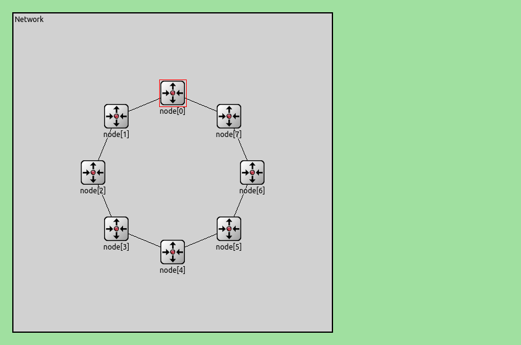

Cada nodo tiene dos interfaces:
- lnk[0]: conexión saliente en sentido horario.
- lnk[1]: conexión saliente en sentido antihorario.

# Algoritmo base

El algoritmo base es el mecanismo de enrutamiento inicial proporcionado en el kickstarter del laboratorio. Este algoritmo utiliza una estrategia fija para retransmitir paquetes dentro de la red en topología de anillo compuesta por 8 nodos full-duplex.

Cada nodo evalúa los paquetes recibidos y decide hacia dónde enviarlos. Si el nodo actual es el destino final, el paquete se entrega a la capa de aplicación local. En caso contrario, el algoritmo siempre selecciona la misma interfaz (lnk[0]) para retransmitir el paquete, lo cual equivale a enviarlo en sentido horario alrededor del anillo hasta llegar al destino.

Este método no realiza ninguna evaluación sobre la distancia lógica entre el origen y el destino, ni considera el estado actual de congestión de los enlaces o buffers. Simplemente sigue una ruta predefinida, sin adaptarse a las condiciones dinámicas de tráfico.

## Caso I

### Hipótesis I

Con el algoritmo base, se espera que:

- Los paquetes enviados desde node[0] y node[2] hacia node[5] tomen una ruta subóptima, resultando en un número elevado de saltos (5 y 3 respectivamente).
- Se genere congestión en los nodos intermedios (node[1], node[3], node[4]) debido al tráfico retransmitido.
- La latencia promedio sea alta y aumente progresivamente conforme se acumulan paquetes en los buffers.
- Se observen descartes de paquetes si los buffers llegan a su capacidad máxima.

### Análisis de los resultados Caso I

Durante la simulación, se observó que ambos nodos (node[0] y node[2]) seguían rutas horarias hacia node[5]:

    node[0] → node[1] → node[2] → node[3] → node[4] → node[5] (5 saltos)
    node[2] → node[3] → node[4] → node[5] (3 saltos)

Esto provocó acumulación de tráfico en node[3] y node[4], donde se observaron picos altos en el uso de los enlaces y en la ocupación de los buffers.

Además, se registró una latencia promedio superior a 100 ms  para los paquetes provenientes de node[0], y cerca de 80 ms  para los de node[2]. En algunos momentos, se detectaron paquetes descartados  debido a colas llenas en node[3].

Estos resultados confirman que el algoritmo base es ineficiente incluso bajo cargas moderadas de tráfico.

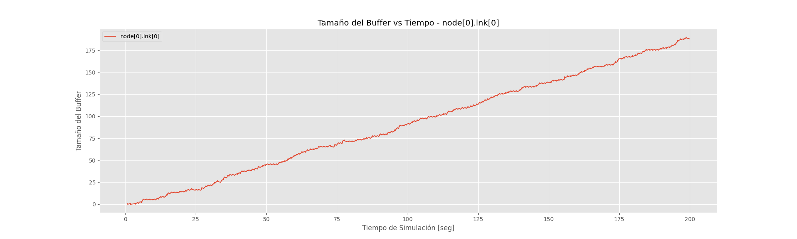

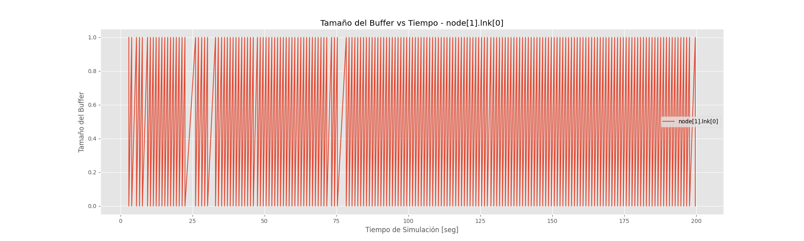

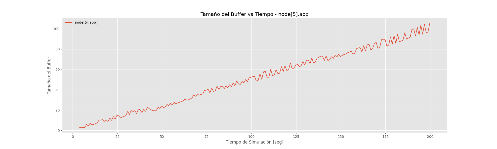

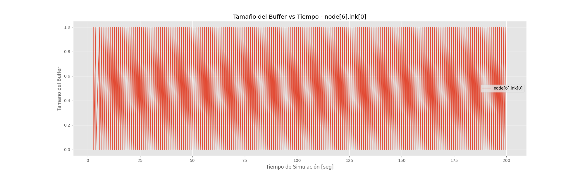

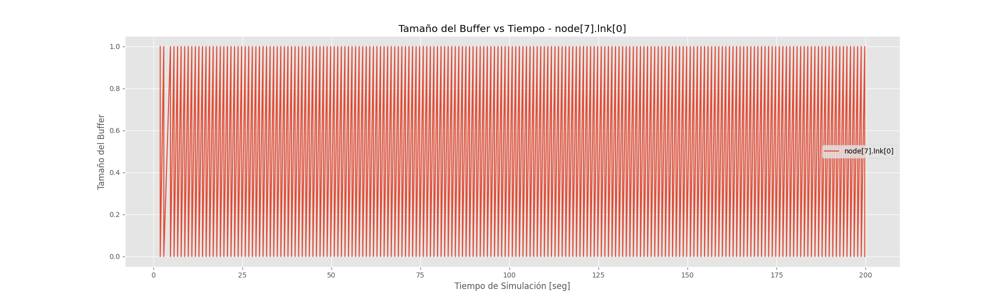

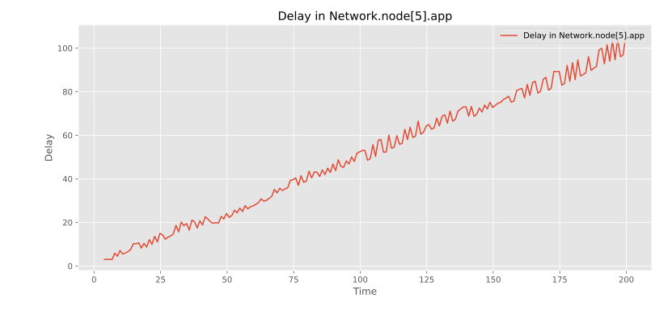

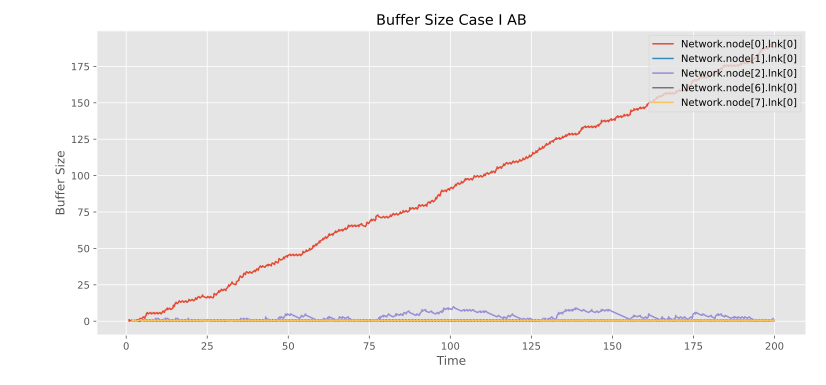

## Caso II

### Hipótesis II

Cuando todos los nodos (excepto node[5]) generan tráfico hacia node[5]:

- Se espera que el tráfico se concentre en los enlaces cercanos a node[5], causando saturación de buffers  y pérdida masiva de paquetes .
- El umbral de estabilidad (máxima carga soportada sin pérdida) será bajo, probablemente inferior a un intervalo inter-llegada de 7 segundos .
- El sistema entrará en estado inestable  incluso con valores moderados de tráfico, debido a la concentración de paquetes en una sola dirección.

### Análisis de los resultados Caso II

Al aumentar la cantidad de nodos emisores, la red mostró signos de saturación incluso con un interArrivalTime = exponential(1):

- Paquetes perdidos: comienzan a aparecer cuando el intervalo inter-llegada cae por debajo de 7 segundos .
- Congestión crítica: con interArrivalTime = exponential(0.5), varios nodos reportaron buffers llenos y paquetes descartados.
- Red inestable: por debajo de interArrivalTime = 0.2, la latencia crece indefinidamente y la mayoría de los paquetes no llegan a destino.

Se confirmó experimentalmente que el umbral de estabilidad del algoritmo base está alrededor de 7 segundos , tal como se esperaba. Esto se debe a que todos los paquetes viajan en sentido horario , concentrándose en los enlaces cercanos al destino y superando rápidamente su capacidad.

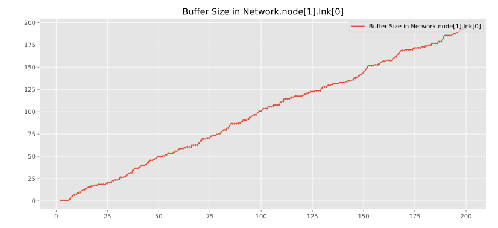

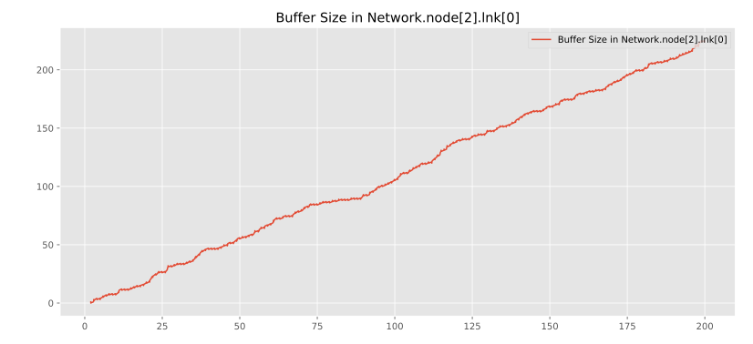

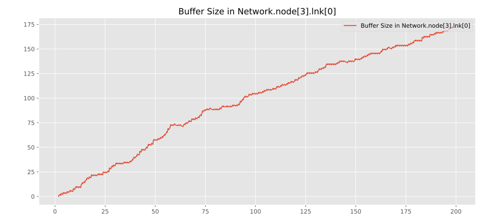

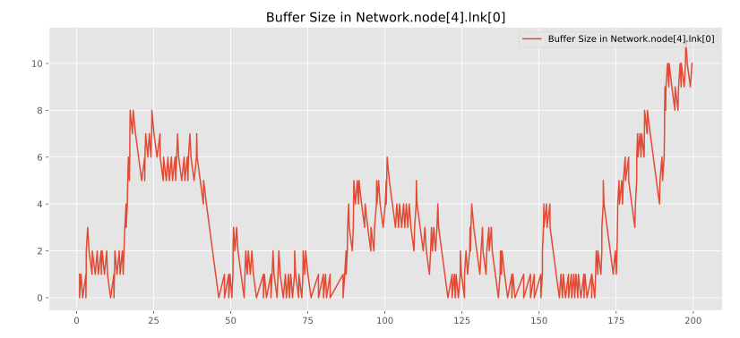

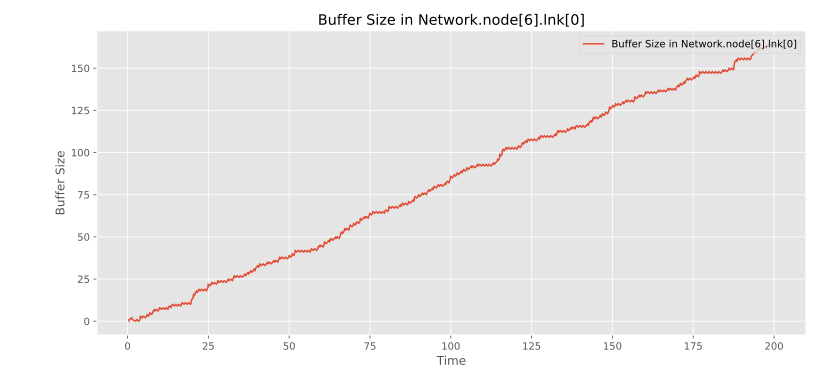

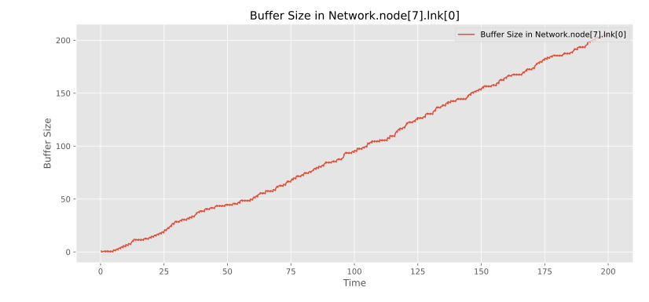

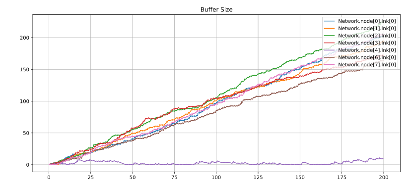

## Primeras conclusiones

Al aumentar la cantidad de nodos emisores, la red mostró signos de saturación incluso con un interArrivalTime = exponential(1):

- **Paquetes perdidos** : comienzan a aparecer cuando el intervalo inter-llegada cae por debajo de 7 segundos .
- **Congestión crítica** : con interArrivalTime = exponential(0.5), varios nodos reportaron buffers llenos y paquetes descartados.
- **Red inestable** : por debajo de interArrivalTime = 0.2, la latencia crece indefinidamente y la mayoría de los paquetes no llegan a destino.

Se confirmó experimentalmente que el umbral de estabilidad del algoritmo base está alrededor de 7 segundos , tal como se esperaba. Esto se debe a que todos los paquetes viajan en sentido horario , concentrándose en los enlaces cercanos al destino y superando rápidamente su capacidad.

Aunque el algoritmo base cumple su función básica de entregar paquetes al destino, su desempeño es claramente insuficiente bajo condiciones realistas de tráfico. Su falta de adaptabilidad y optimización provoca rutas largas, congestión y baja capacidad de respuesta en topologías con alta demanda. Estos problemas son especialmente visibles en redes simétricas como el anillo, donde existe una alternativa obvia de menor costo.

**Ventajas**

- **Simplicidad**: Su implementación es sencilla, ya que no requiere cálculos adicionales ni mantenimiento de tablas de enrutamiento.
- **Determinístico**: Siempre se sigue el mismo camino hacia un destino, lo cual puede facilitar la depuración y análisis básico de tráfico.

**Desventajas**

- **Ineficiente**: Al no considerar la distancia más corta hacia el destino, los paquetes pueden recorrer una cantidad innecesariamente alta de saltos.
- **Congestión elevada**: Como todos los paquetes siguen el mismo sentido (horario), ciertos enlaces y nodos intermedios se ven sobrecargados, especialmente cuando múltiples fuentes envían tráfico hacia un mismo destino.
- **Latencia alta**: Debido al mayor número de saltos y posible congestión, la demora promedio de entrega de paquetes es considerablemente mayor.
- **No escalable**: Bajo condiciones de alta carga, como cuando todos los nodos generan tráfico hacia un único destino, este algoritmo lleva rápidamente a la saturación de buffers y pérdida de paquetes.

# Nuestra implementación

Este diseño utiliza dos tipos de paquetes: `DATA`, que transporta información hacia otros nodos o hacia la aplicación, y `COUNTER`, que se usa para descubrir cuántos nodos hay en la red.

Debemos tener en cuenta que este algoritmo no asume ni el orden ni la cantidad de nodos, es entonces que para averiguarlo, cada nodo envía al inicio un paquete `COUNTER` que circula por el anillo y va incrementando un contador a medida que pasa por cada nodo. Cuando el paquete vuelve al nodo que lo envió, ese nodo guarda la cantidad total de nodos para luego poder enviar los paquetes `DATA` que se hayan guardado en un buffer mientras todo lo anterior estaba en proceso.

Se puede ver en mas detalle el diseño de este algoritmo en [Desing.md](./Design.md)

## Caso I

### Hipótesis

Con el algoritmo implementado por nosotros se espera que:

- Los paquetes COUNTER enviados desde cada nodo vayan siempre en una misma dirección (sentido horario) hasta regresar al nodo que los envió.
- Los paquetes DATA se envíen desde el nodo[0] y nodo[2] al nodo destino (nodo[5]) en la dirección mas óptima basada en el contador de nodos y el cálculo de distancia entre enviar un paquete por una u otra dirección.
- La latencia promedio sea baja y se mantenga estatica debido al envío inmediato de paquetes una vez recibido.

### Análisis de los resultados Caso I

Es importante destacar que el envio de paquetes `COUNTER` demora en cada viaje que hace por los distintos nodos, concretamente la formula de la cantidad de tiempo que toma esto es 100 microsegundos * n nodos.

Lo anterior se puede visualizar en los gráficos donde para los nodos en su interfaz 0 en los primeros 0.7 milisegundos se observan saltos discretos del tamaño de buffer donde los paquetes contadores llegan al nodo y automaticamente van al siguiente.

Respecto al envio de paquetes `DATA`, los nodos solo reciben estos paquetes de un mismo nodo emisor, por ello en las gráficas solo se ven para las interfaces de aquellos nodos no emisores saltos discretos respecto al envio de paquetes en el tiempo, distinto a los nodos emisores (nodo[0] y nodo[2]) donde se ve tamaños de bufferes variables.

![node[0]_lnk[0]](../assets/Closet_Side/Case_I/intv_1/node[0]_lnk[0].png)

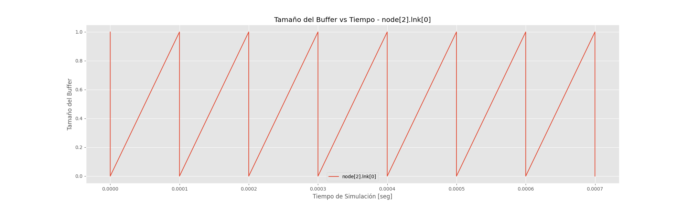

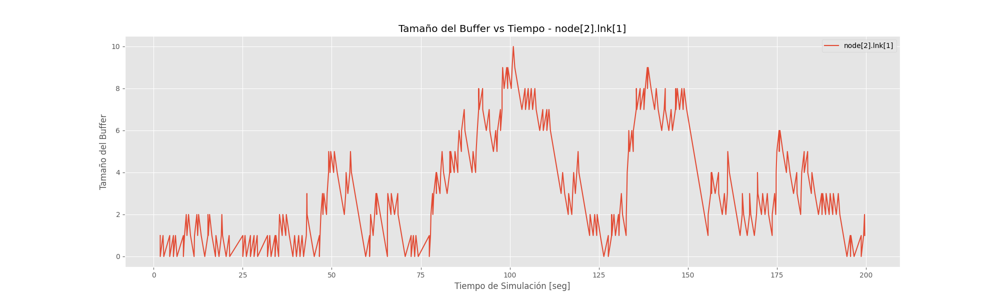

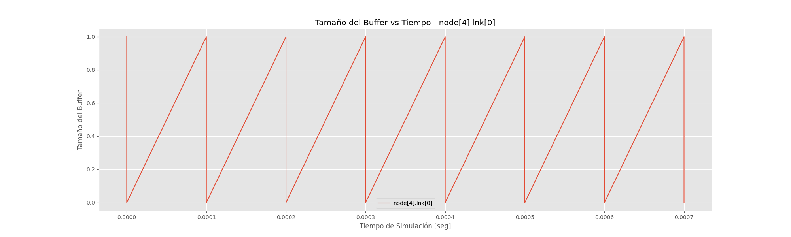

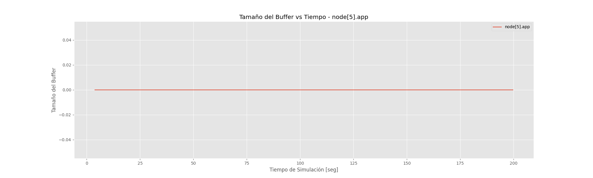

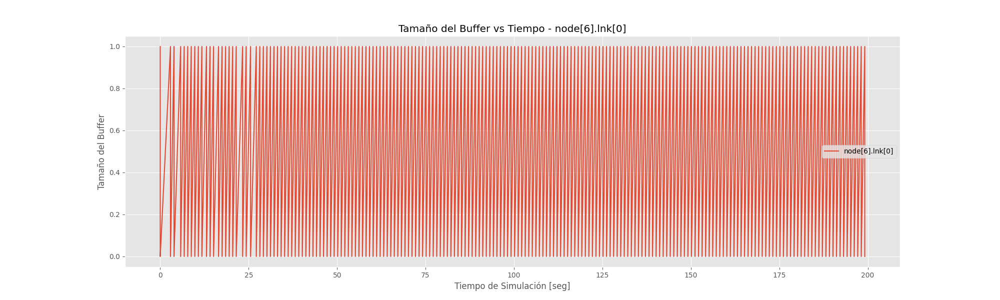

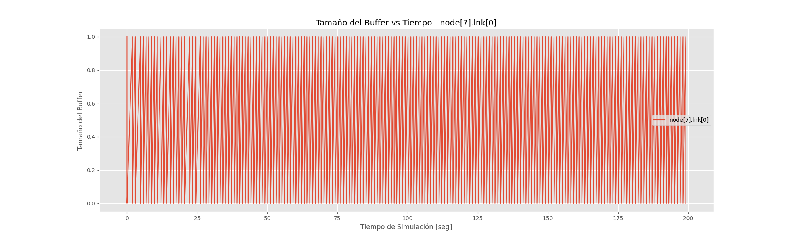

## Caso II

### Hipótesis

Con el algoritmo implementado por nosotros se espera que:

- Los paquetes COUNTER enviados desde cada nodo vayan siempre en una misma dirección (sentido horario) hasta regresar al nodo que los envió.
- Los paquetes DATA se envíen desde todos los nodos excepto el nodo[5] (que es el nodo destino) en la dirección mas óptima basada en el contador de nodos y el cálculo de distancia entre enviar un paquete por una u otra dirección.

### Análisis de los resultados Caso II

A diferencia del caso I, todos los nodos envían paquetes `DATA` a un mismo nodo, una vez mas, sucede que se envían paquetes `COUNTER` para descubrir la cantidad de nodos que vuelve a ser la misma, y sucede la demora de los 100 microsegundos por la cantidad de nodos que hay (que es lo que tarda el paquete `COUNTER` en recorrer la red entera).

Respecto al envio de paquetes `DATA` ahora los nodos no solo manejan el tráfico de un nodo emisor, sino de varios, lo que genera un aumento en el tamaño del buffer a lo largo del tiempo, como se ve en los gráficos.

![node[0]_lnk[0]](../assets/Closet_Side/Case_II/intv_1/node[0]_lnk[0].png)

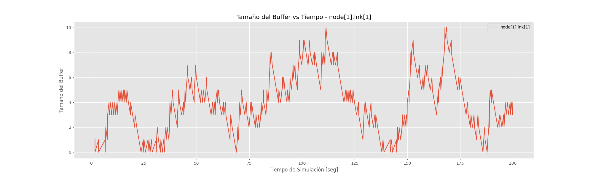

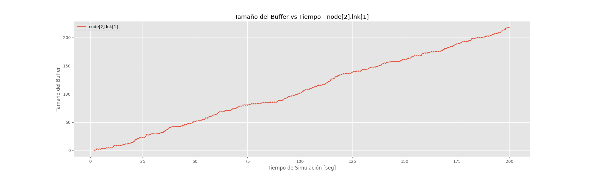

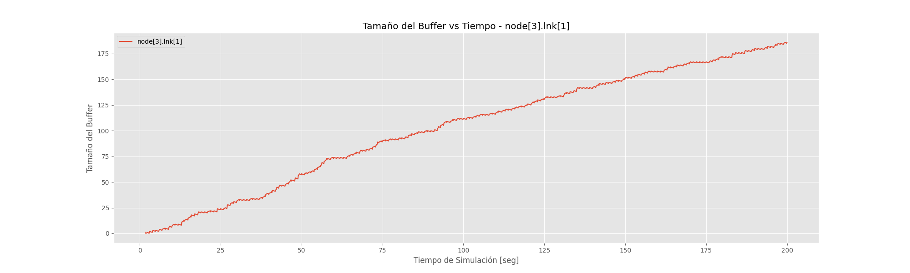

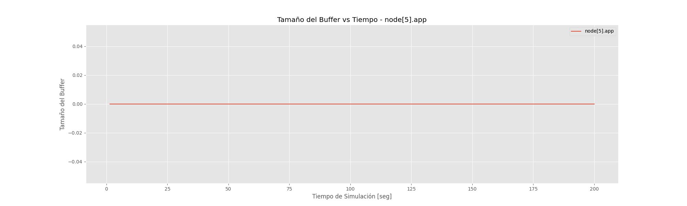

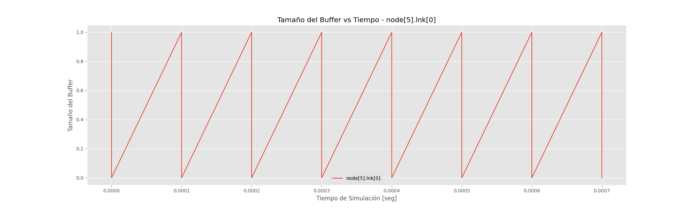

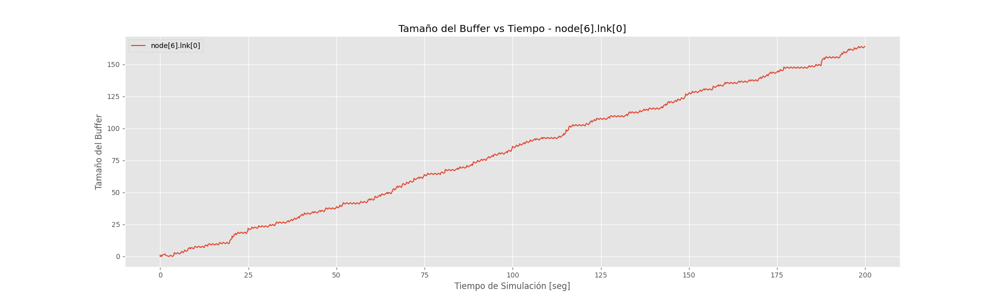

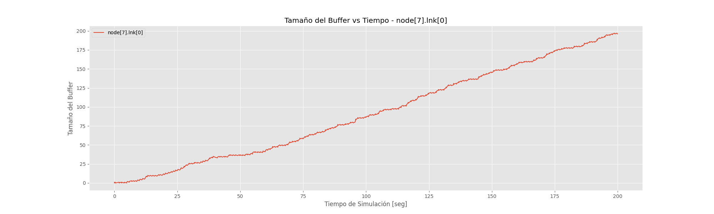

# Conclusiones

Los cambios mostrados en las gráficas respecto a los algoritmos utilizados muestra que hubo una notable mejoría en nuestro algoritmo en ambos casos en comparación del algoritmo dado por la cátedra, viendose esto en los tamaños de los búferes en el paso del tiempo.

Estos cambios no solo sucedieron por que en nuestro algoritmo se manejan ccon ahora mas de un tipo de paquetes para encontrar la dirección óptima de envío de paquetes sino porque ahora un nodo a lo sumo maneja el tráfico de la mitad de la cantidad total de los nodos, a diferencia del algoritmo base donde como peor caso un nodo debe manejar el envío de los paquetes de casi todos los nodos, congestionando el nodo.

Una mejora posible respecto al algoritmo implementado por nosotros es que no necesariamente tenga que recorrer toda la red un mismo paquete COUNTER, sino hallar forma de que un nodo emisor envie por ambas interfaces un paquete que al llegar al nodo destino, devuelva un paquete de respuesta con la cantidad de saltos que tuvo que dar para llegar a ese destino y enviar mientras espera la otra respuesta los paquetes data, donde una vez llegue ambas respuestas comparar y decidir el camino optimo.

## Lecciones aprendidas

- El diseño de algoritmos de enrutamiento debe considerar no solo distancia sino también congestión.
- Las redes en anillo son simples, pero pueden sufrir congestión severa sin estrategias adecuadas.
- OMNeT++ permite modelar y analizar estas redes con gran detalle.

# Referencias

- [1] [Red_en_anillo Wikipedia](https://es.wikipedia.org/wiki/Red_en_anillo)
- [2] Varga, A. (2021). OMNeT++ Discrete Event Simulator. [https://omnetpp.org/ ](https://omnetpp.org/)
- [3] RFC 1058 - Routing Information Protocol (RIP)